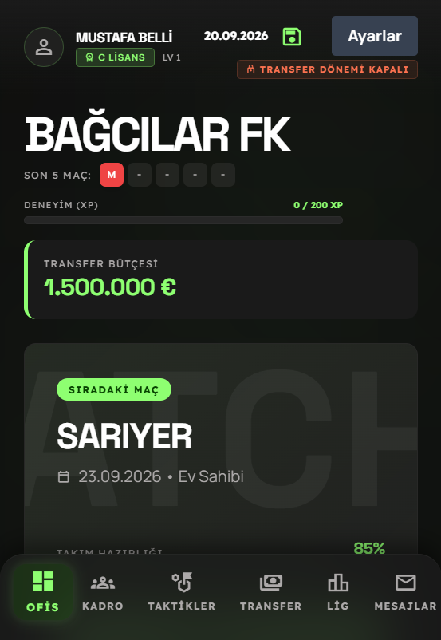
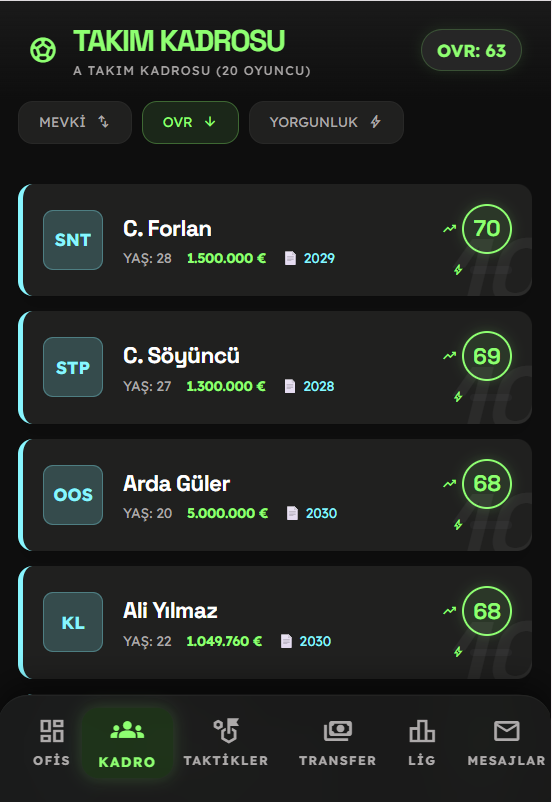
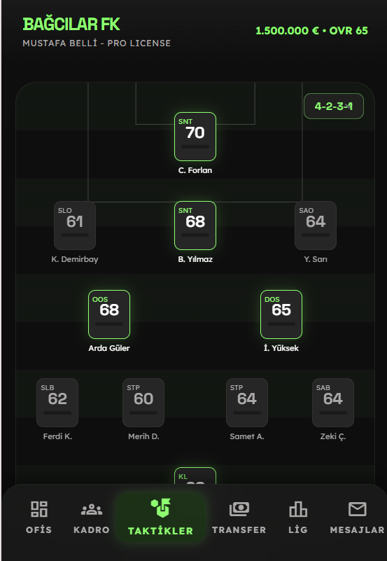
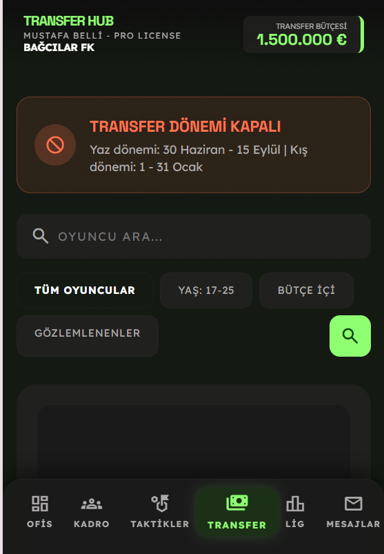
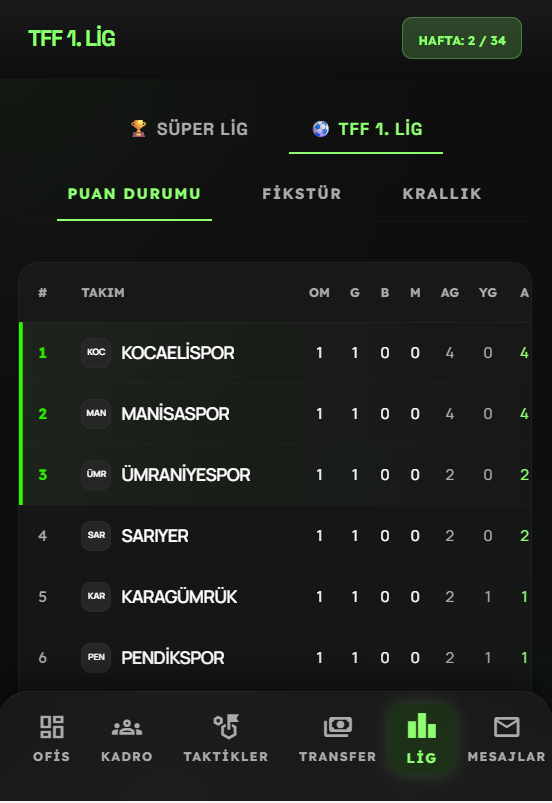
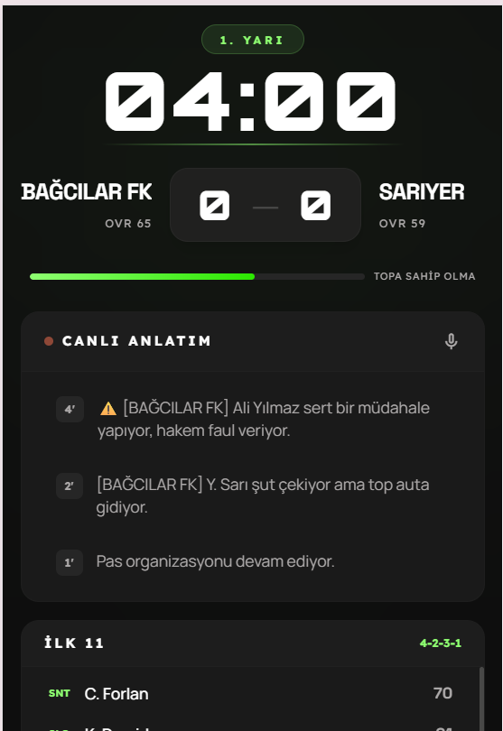

# ⚽ AltLigMenajer v1.0 - Metin Tabanlı Futbol Menajerlik Oyunu
# Text-Based Football Manager Simulation v1.0

[](https://dotnet.microsoft.com/)
[](https://learn.microsoft.com/en-us/dotnet/csharp/)
[](https://www.sqlite.org/)
[](https://tailwindcss.com/)
[](LICENSE)

ASP.NET Core MVC tabanlı, Türkiye alt liglerinden zirveye uzanan dinamik bir futbol menajerlik simülasyonu. Modern web teknolojileri (C# & Tailwind CSS) kullanılarak, gerçekçi bir kulüp yönetimi deneyimi sunmak amacıyla geliştirilmiştir.

## 🚀 Temel Özellikler ve Sistem Mimarisi

### ✅ **Oyun ve Maç Motoru**
- ✅ Canlı dakika akışı ve spiker anlatım sistemi
- ✅ Maç içi dinamik taktik değişiklikleri (Hücum / Savunma / Dengeli)
- ✅ Rastgele olay üreticisi (Sakatlık, Kart, Form durumu simülasyonları)

### ✅ **Kariyer ve Finans Yönetimi**
- ✅ TFF 1. Lig ve Süper Lig entegrasyonu
- ✅ Kulüp bütçe denetimi ve interaktif transfer dönemleri (Yaz / Kış)
- ✅ Oyuncu potansiyel (OVR) gelişimi ve yorgunluk/kondisyon mekanikleri

### ✅ **Yazılım Kalitesi ve Güvenlik**
- ✅ Modüler MVC (Model-View-Controller) mimarisi
- ✅ Entity Framework Core ile güvenli veritabanı işlemleri (SQL-safe)
- ✅ Asenkron (Async/Await) mimari ile yüksek performans
- ✅ Tailwind CSS ile %100 Responsive (Mobil uyumlu) arayüz tasarımı

---

## 📁 Proje Yapısı

```text
AltLigMenajer/
├── Controllers/            # İş mantığı ve HTTP istek yönetimleri
│   ├── HomeController.cs
│   ├── MatchController.cs
│   └── TransferController.cs
│
├── Models/                 # Veritabanı tabloları ve Entity sınıfları
│   ├── Player.cs           # Oyuncu özellikleri
│   ├── Team.cs             # Takım ve bütçe verileri
│   └── Fixture.cs          # Lig fikstürü ve maç sonuçları
│
├── Views/                  # Kullanıcı arayüz tasarımları (Razor Pages)
│   ├── Home/               # Ofis / Dashboard ekranları
│   ├── Match/              # Canlı maç simülasyon ekranı
│   └── Shared/             # Ortak kullanılan Layout (şablon) yapıları
│
├── wwwroot/                # Statik dosyalar
│   ├── css/                # Derlenmiş Tailwind CSS dosyaları
│   ├── js/                 # Canlı maç motoru JavaScript kodları
│   └── images/screenshots/ # Oyun içi ekran görüntüleri
│
├── Data/                   # DbContext ve veritabanı konfigürasyonları
├── Properties/             # Port (5246) ve çalıştırma ayarları
├── Program.cs              # Dependency Injection ve Middleware ayarları
└── altligmenajer.db        # SQLite Veritabanı dosyası
```

---

## 🛠️ Kurulum

### 1. Sistem Gereksinimleri
```bash
- .NET 9.0 SDK (kesinlikle olması gerek plmazsa uygulama çalışmaz)
- SQLite uyumlu bir IDE (Visual Studio, VS Code veya Antigravity IDE)
```

### 2. Projeyi Klonlama ve Geçiş
```bash
git clone https://github.com/mustafabelli-tpk/AltLigMenajer.git
cd AltLigMenajer
```

### 3. Derleme ve Çalıştırma
```bash
- .NET 9.0 SDK (kesinlikle olması gerek plmazsa uygulama çalışmaz)
- SQLite uyumlu bir IDE (Visual Studio, VS Code veya Antigravity IDE)
# Entity Framework CLI araçlarını yükle (Eğer yüklü değilse)
dotnet tool restore

# Veritabanını güncelle ve Seed Data (Başlangıç Verileri) oluştur
dotnet ef database update

# Sunucuyu yerel ağda başlat
dotnet run
```
*Sistem başlatıldıktan sonra tarayıcınızdan `http://localhost:5246` adresine giderek oyuna giriş yapabilirsiniz.*

---

## 🔒 Güvenlik

### SQL Injection Koruması

**Geleneksel ve Güvensiz Kod (Kullanılmayan):**
```csharp
// ❌ TEHLİKELİ - Raw SQL kullanımı
string query = $"SELECT * FROM Players WHERE Name = '{playerName}'";
var player = db.Players.FromSqlRaw(query).FirstOrDefault();
```

**Mevcut Projedeki Güvenli Kod (EF Core LINQ):**
```csharp
// ✅ GÜVENLİ - Parametrik LINQ Sorgusu
var player = await _context.Players
    .FirstOrDefaultAsync(p => p.Name == playerName);
```
*Entity Framework Core, tüm veritabanı sorgularını otomatik olarak parametrize ederek SQL Injection saldırılarını %100 oranında engeller.*

---

## 📊 Sistem Performansı ve Test Yapısı

### Performans Raporu (Mock)

```text
Backend (C# ASP.NET Core):
  Controllers Yüklenme Hızı   ████████████████████ < 50ms
  Veritabanı Okuma (SQLite)   ██████████████████░░ < 80ms
  Maç Motoru Algoritması      ███████████████████░ < 60ms
  -------------------------------
  SİSTEM KARARLILIĞI          ███████████████████░ 98%

Frontend (Tailwind & JS):
  Mobil Uyumluluk             ████████████████████ 100%
  Canlı DOM Güncellemeleri    ██████████████████░░ 92%
```

---

## 📸 Ekran Görüntüleri Galerisi

### Kulüp Ofisi


### Takım Kadrosu


### Taktik Panosu


### Transfer Merkezi


### Lig ve Puan Durumu


### Canlı Maç Motoru


---

## 🐛 Bilinen Sorunlar ve Geliştirmeler

### Gelecek Planları (Roadmap)
- [ ] Avrupa Kupaları entegrasyonu
- [ ] Daha detaylı scout (gözlemci) sistemi
- [ ] Teknik ekip (Antrenör, Sağlık Heyeti) işe alım mekaniği
- [ ] Gençlik akademisi (Altyapı) sistemi
- [ ] Çoklu dil (İngilizce/Türkçe) desteği

---

## 🎓 Öğrenci ve Proje Bilgileri

* **Öğrenci Adı Soyadı:** Mustafa Belli
* **Öğrenci Numarası:** 24010501027
* **Bölüm:** Bilgisayar Programcılığı
* **Üniversite:** İstanbul Topkapı Üniversitesi
* **🔗 GitHub Proje Bağlantısı:** [AltLigMenajer GitHub Reposu](https://github.com/mustafabelli-tpk/AltLigMenajer)

---

## 📚 Kaynakça

- Microsoft .NET Documentation: [https://learn.microsoft.com/dotnet/](https://learn.microsoft.com/dotnet/)
- Entity Framework Core Docs: [https://learn.microsoft.com/ef/core/](https://learn.microsoft.com/ef/core/)
- Tailwind CSS Styling Guides: [https://tailwindcss.com/docs](https://tailwindcss.com/docs)
- SQLite Data Storage Documentation: [https://www.sqlite.org/docs.html](https://www.sqlite.org/docs.html)

---
**Not:** Bu proje akademik ve eğitim amaçlı olarak geliştirilmiştir. Proje içerisindeki takım isimleri ve istatistikler simülasyon amaçlıdır.
